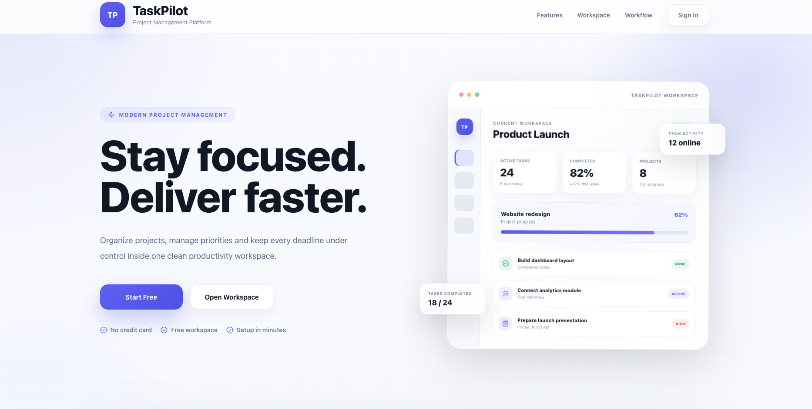

# TaskPilot

<p align="center">
  
</p>

<h3 align="center">
Organize your workspaces, manage projects, and stay productive with an intuitive task management application.
</h3>

<p align="center">


</p>

<p align="center">
<strong><a href="https://taskpilot1.vercel.app/">Live Demo</a></strong>
</p>

---

# Overview

TaskPilot is a modern productivity application built with **React**, **TypeScript**, and **Vite** that helps users organize their work through dedicated workspaces, projects, and tasks.

The application provides a clean dashboard experience where users can create projects, manage daily tasks, monitor deadlines through a calendar, and review productivity statistics from a single interface.

This is a **frontend-only** project — there is no backend. All data (users, workspaces, projects, tasks) is persisted in the browser's `localStorage`. It was built to demonstrate modern frontend development practices, including component-based architecture, Context API state management, protected routing, reusable UI design, responsive layouts, and unit testing.

**Try it live:** [taskpilot1.vercel.app](https://taskpilot1.vercel.app/)

---

# Project Highlights

✔ Multiple Workspaces

✔ Project Management (isolated per workspace)

✔ Complete Task Management

✔ Interactive Dashboard with Search, Filter & Sort

✔ Monthly Calendar

✔ Productivity Analytics

✔ Authentication (register / login / logout / delete account)

✔ Protected Routes

✔ Drag & Drop Task Reordering

✔ Responsive Design

✔ Context API State Management

✔ Unit Testing with Vitest

---

# Preview

## Dashboard

The Dashboard acts as the central workspace where users can quickly access active projects, manage tasks, monitor progress, and organize their daily workflow.

```
docs/screenshots/dashboard.png
```

---

# Core Features

## Workspace Management

Separate different areas of work by creating independent workspaces. Tasks and projects are scoped to the active workspace.

### Features

- Create workspaces
- Edit workspace information
- Delete workspaces
- Switch between workspaces
- Color customization
- Independent workspace organization — tasks and projects created in one workspace are not visible from another

```
docs/screenshots/workspaces.png
```

---

## Project Management

Projects help organize related tasks inside each workspace.

### Features

- Create projects
- Update projects
- Delete projects
- Project details page with per-project progress
- Project color labels
- Progress tracking

```
docs/screenshots/projects.png
```

---

## Task Management

TaskPilot includes everything needed for everyday task planning.

### Features

- Create tasks
- Edit tasks
- Delete tasks
- Mark tasks as completed
- Assign tasks to projects
- Due dates, due time, and time zone
- Categories
- Priority levels
- Task descriptions

```
docs/screenshots/tasks.png
```

---

## Dashboard

The Dashboard combines task management and productivity tools into a single workspace.

### Dashboard Includes

- Task overview with live statistics (total, active, completed, due today)
- Search
- Filtering (all / active / completed)
- Sorting (newest, oldest, due date, priority, alphabetical)
- Quick task creation
- Drag & drop reordering (available when sorted by "Newest")

```
docs/screenshots/dashboard.png
```

---

## Drag & Drop

Tasks on the Dashboard can be reordered using **dnd-kit**.

Features include:

- Smooth dragging
- Instant reordering
- Visual feedback
- Persistent task order (stored as an explicit `order` field, independent of creation order)

> Reordering is only available while sorted by "Newest," since any other sort (priority, due date, alphabetical) determines card position by that criterion rather than manual order — the drag handle is hidden in those views to avoid a control that wouldn't visibly do anything.

```
docs/screenshots/drag-drop.gif
```

---

# Calendar

The Calendar helps users visualize upcoming work by displaying tasks based on their assigned due dates.

Instead of reviewing long task lists, users can quickly identify deadlines and better plan their workload using a monthly calendar view.

### Features

- Monthly calendar layout
- Tasks displayed on their due dates
- Current day highlighting
- Quick deadline overview
- Visual task indicators
- Responsive calendar interface

```
docs/screenshots/calendar.png
```

---

# Analytics

The Analytics page provides a high-level overview of productivity across the current workspace.

Instead of manually calculating progress, users can instantly see how much work has been completed, how their workload is distributed, and what still needs attention.

### Features

- Total, active, and completed task counts
- Circular progress indicators for active and completed tasks
- Overall completion rate
- Breakdown of tasks by category
- Breakdown of tasks by priority

```
docs/screenshots/analytics.png
```

---

# Authentication

TaskPilot includes a complete authentication flow for managing personal accounts and protecting application routes.

### Features

- User registration (two-step: email, then profile + password)
- Login with email/password validation
- Protected routes
- Password reset request flow (UI-only — see [Known Limitations](#known-limitations))
- Persistent authentication
- Logout functionality
- Account deletion, including all associated tasks and projects

---

# Profile

Users can manage their personal account information from the Profile page.

### Features

- View profile information
- Update account details (full name, workspace name)
- Manage personal settings
- Delete account with confirmation

```
docs/screenshots/profile.png
```

---

# Settings

The Settings page allows users to review workspace preferences and manage account session.

### Features

- Workspace preferences overview
- Log out

```
docs/screenshots/settings.png
```

---

# Application Architecture

TaskPilot follows a modular component-based architecture that separates application logic, state management, reusable UI components, and page-level containers.

```
App
│
├── Context Providers
│   ├── AuthContext
│   ├── ProjectContext
│   └── TaskContext
│
├── Protected Routes
│
├── Dashboard Pages
│
└── Reusable Components
    └── useModal — shared hook for Escape / focus / scroll-lock /
        overlay-click behavior, used by all four modals in the app
```

---

# State Management

Global state is managed using the **React Context API**, allowing data to be shared across the application without external state management libraries.

## AuthContext

Responsible for:

- Authentication
- Current user
- Login
- Registration
- Logout
- Account deletion (cascades to tasks and projects)
- Protected routes

---

## ProjectContext

Responsible for:

- Project management
- Creating projects
- Updating projects
- Deleting projects
- Workspace-scoped project organization

---

## TaskContext

Responsible for:

- Task management
- Task completion
- Editing tasks
- Task deletion
- Dashboard task ordering (explicit `order` field, decoupled from array position)

---

# Tech Stack

## Frontend

- React 19
- TypeScript
- Vite
- React Router

## State Management

- React Context API

## Styling

- CSS
- CSS Variables
- Responsive Layouts

## Drag & Drop

- dnd-kit

## Testing

- Vitest
- React Testing Library
- Jest DOM

## Development

- ESLint (including `eslint-plugin-jsx-a11y`)
- npm

---

# Project Structure

```text
src
├── components
│   ├── dashboard
│   ├── DeleteAccountModal.tsx
│   └── WorkspaceModal.tsx
│
├── context
│   ├── AuthContext.tsx
│   ├── ProjectContext.tsx
│   └── TaskContext.tsx
│
├── hooks
│   └── useModal.ts
│
├── pages
│   ├── dashboard
│   ├── Home.tsx
│   ├── Login.tsx
│   ├── Overview.tsx
│   ├── Profile.tsx
│   ├── Settings.tsx
│   ├── ProtectedRoute.tsx
│   ├── RegisterStepOne.tsx
│   ├── RegisterStepTwo.tsx
│   └── ResetPassword.tsx
│
├── services
│
├── styles
│
├── tests
│
├── types
│
└── utils
    ├── authHelpers.ts
    ├── authStorage.ts
    ├── constants.ts
    ├── dates.ts
    └── validators.ts
```

The project structure separates pages, reusable components, application state, styles, utilities, and services, making the codebase easier to understand, maintain, and extend.

---

# Testing

The application includes unit tests covering the most important parts of the project.

### Tested Components

- Authentication Context
- Project Context
- Task Context
- Task Modal
- Task Toolbar
- Task Card
- Dashboard Statistics
- Overview Page

---

# Installation

> Prefer to just try it? Use the [Live Demo](https://taskpilot1.vercel.app/) instead — no setup required.

```bash
git clone https://github.com/kseniiaross/taskpilot.git
cd taskpilot
npm install
npm run dev
```

The app will be available at `http://localhost:5173`.

---

# Available Scripts

| Command | Description |
|----------|-------------|
| `npm run dev` | Starts the Vite development server |
| `npm run build` | Creates a production build |
| `npm run preview` | Runs the production build locally |
| `npm run test` | Runs unit tests |
| `npm run coverage` | Generates a coverage report |
| `npm run lint` | Runs ESLint |

---

# Responsive Design

TaskPilot is designed to provide a consistent experience across different screen sizes.

The interface automatically adapts for:

- Desktop
- Laptop
- Tablet
- Mobile

```
docs/screenshots/responsive.png
```

---

# Code Quality

The project follows modern frontend development practices.

## Highlights

- Component-based architecture
- Reusable UI components (e.g. a single `useModal` hook shared by all modals instead of four separate implementations)
- Context-based state management
- Modular folder organization
- TypeScript type safety (`strict` mode)
- Responsive layouts
- Consistent styling via CSS variables
- Unit testing
- ESLint configuration, including accessibility linting (`jsx-a11y`)

---

# Known Limitations

This is a frontend-only portfolio project. A few tradeoffs were made intentionally rather than left unnoticed:

- **Passwords are stored in plain text in `localStorage`.** There is no backend to hash and verify credentials against, so this is a deliberate simplification for demo purposes — not a pattern suitable for a real authentication system.
- **Password reset doesn't send an actual email.** The UI flow (request → confirmation screen) is fully implemented, but no email is sent, since there's no backend to send one from.
- **Drag & drop reordering only works when tasks are sorted by "Newest."** Under any other sort, position is determined by that sort criterion, so manual reordering wouldn't have a meaningful effect — the drag handle is hidden in that case.

---

# Technologies Used

| Category | Technologies |
|----------|--------------|
| Frontend | React 19, TypeScript, Vite |
| Routing | React Router |
| State Management | React Context API |
| Styling | CSS, CSS Variables |
| Drag & Drop | dnd-kit |
| Testing | Vitest, React Testing Library, Jest DOM |
| Linting | ESLint, eslint-plugin-jsx-a11y |

---

# Future Improvements

Possible future enhancements include:

- A real backend with hashed credentials and email-based password reset
- Team collaboration
- Cloud synchronization
- Task reminders
- Recurring tasks
- File attachments
- Comments
- Dark mode
- Kanban board
- Advanced filtering
- Calendar integrations
- Push notifications
- Mobile application

---

# What I Learned

TaskPilot was built to strengthen practical experience with modern frontend development.

Key areas explored throughout the project include:

- React architecture
- TypeScript
- Context API
- Protected routing
- State management
- Component composition and hook extraction (e.g. consolidating duplicated modal logic into `useModal`)
- Drag & Drop interactions
- Responsive UI development
- Form validation
- Unit testing with Vitest
- Reading and fixing real bugs with `tsc`, ESLint, and accessibility linting
- Project organization
- Scalable application structure

---

# Screenshots

```
docs/
└── screenshots/
    ├── home.png
    ├── dashboard.png
    ├── workspaces.png
    ├── projects.png
    ├── tasks.png
    ├── calendar.png
    ├── analytics.png
    ├── profile.png
    ├── settings.png
    ├── responsive.png
    └── drag-drop.gif
```

---

# Author

**Kseniia Rostovskaia**

Frontend Developer

Portfolio: https://kseniiaross.dev/

GitHub: https://github.com/kseniiaross

LinkedIn: https://linkedin.com/in/kseniia-rostovskaia/

---

If you found this project interesting, feel free to fork it, explore the codebase, or leave a star on GitHub.